# Building useful things with code 👋

  

  

  
  &nbsp;
  
  &nbsp;
  

---

### 💫 关于我 (About Me)

我喜欢从想法出发构建实用的软件，关注 AI 开发工具、全栈应用和跨平台体验，也持续通过开源项目探索新的工程实践。

- 🔭 **当前专注于**：AI 应用、Coding Agent 与开发者工具。
- 🧩 **项目方向**：Rust 系统工具、TypeScript 产品和跨平台应用。
- 🌱 **持续探索**：高性能服务、自动化工作流与更好的开发体验。
- 💬 **欢迎交流**：开源项目、工程实践，以及任何有趣的技术想法。

---

### 🛠️ 技术栈与工具箱 (Tech Stack)

  
  
  
  
   
  
  
  

---

### 🚀 精选项目 (Featured Projects)

- **[yode](https://github.com/anYuJia/yode)** — 面向终端的开源 AI coding agent。
- **[better-douyin](https://github.com/anYuJia/better-douyin)** — 面向内容管理与 AI 交互的综合工具。
- **[better-email](https://github.com/anYuJia/better-email)** — 更注重体验的邮箱客户端。
- **[agentbridge](https://github.com/anYuJia/agentbridge)** — 面向 Agent 场景的 Go 项目。
- **[ptype](https://github.com/anYuJia/ptype)** — 支持中文、英文和代码的打字练习网站。

---

### 📊 GitHub 统计 (GitHub Analytics)

  
  &nbsp;&nbsp;
  

  

